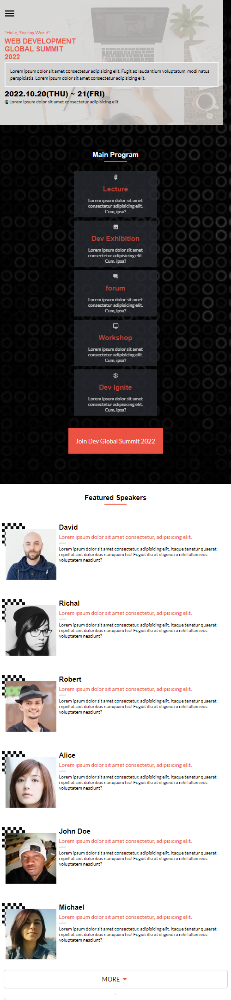
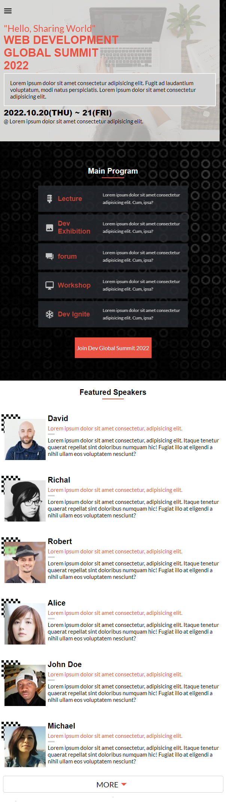
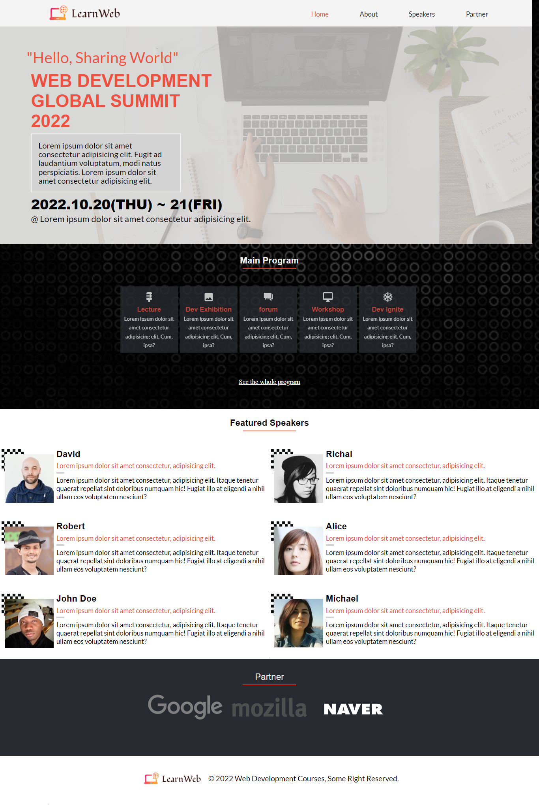

# LearnWeb

> In this website you will learn how to create a web application using the Html Css and Javascript.

## Built With

- HTML
- CSS
- JavaScript

## Screenshot

### Small Devices

### Medium Devices

### Desktop Devices 

## Live Demo

## Authors

👤 **Aamir Khan**

- GitHub: [@aamirkhan2478](https://github.com/aamirkhan2478)
- Twitter: [@SmartKhan2478](https://twitter.com/SmartKhan2478)
- LinkedIn: [LinkedIn](https://www.linkedin.com/in/aamir-khan-302a44237/)

## 🤝 Contributing

Contributions, issues, and feature requests are welcome!

Feel free to check the [issues page](https://github.com/aamirkhan2478/portfolio-project/issues).

## Show your support

Give a ⭐️ if you like this project!

## 📝 License

This project is [MIT](./LICENSE) licensed.

